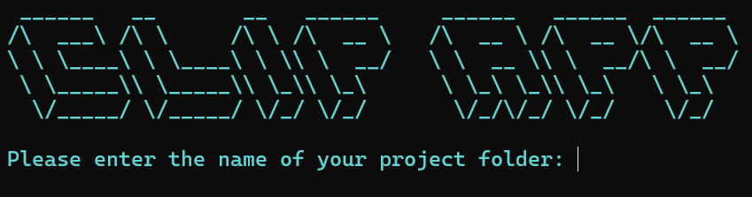

# CLIP application

Redesign of the application developed by [ThorkildFregi](https://github.com/ThorkildFregi) and [Altomator](https://github.com/altomator).

**PLEASE NOTE**: the integration of a fine-tuning process is under development.

This application uses a CLIP (*Contrastive Language-Image Pre-training*) model to process images and query them in natural language, all *via* a web interface.

- [Download the application](https://github.com/NatachaGrim/Application-CLIP/tree/main?tab=readme-ov-file#download-the-application)
- [Data structure](https://github.com/NatachaGrim/Application-CLIP/tree/main?tab=readme-ov-file#data-structure)
  - [Files and folders required](https://github.com/NatachaGrim/Application-CLIP/tree/main?tab=readme-ov-file#files-and-folders-required)
  - [Data required](https://github.com/NatachaGrim/Application-CLIP/tree/main?tab=readme-ov-file#data-required)
  - [Generated files](https://github.com/NatachaGrim/Application-CLIP/tree/main?tab=readme-ov-file#generated-files)
- [Setting up the virtual environment](https://github.com/NatachaGrim/Application-CLIP/tree/main?tab=readme-ov-file#setting-up-the-virtual-environment)
  - [Installing Python](https://github.com/NatachaGrim/Application-CLIP/tree/main?tab=readme-ov-file#step-1-installing-python)
  - [Installing a virtual environment](https://github.com/NatachaGrim/Application-CLIP/tree/main?tab=readme-ov-file#step-2-installing-a-virtual-environment)
  - [Installing dependencies](https://github.com/NatachaGrim/Application-CLIP/tree/main?tab=readme-ov-file#step-3-installing-dependencies)
- [Launch](https://github.com/NatachaGrim/Application-CLIP/tree/main?tab=readme-ov-file#launch)
  - [Position yourself in the right folder](https://github.com/NatachaGrim/Application-CLIP/tree/main?tab=readme-ov-file#step-1-position-yourself-in-the-right-folder)
  - [Activate the virtual environment](https://github.com/NatachaGrim/Application-CLIP/tree/main?tab=readme-ov-file#step-2-activate-the-virtual-environment)
  - [Run the launcher](https://github.com/NatachaGrim/Application-CLIP/tree/main?tab=readme-ov-file#step-3-run-the-launcher)
  - [Quit the application](https://github.com/NatachaGrim/Application-CLIP/tree/main?tab=readme-ov-file#step-4-quit-the-application)

__________

## Download the application

At the top of the page is a green ```<> Code``` button. Click on it and select the ```Download ZIP``` option. Extract the files to the location of your choice on your computer.

## Data structure

To ensure all the steps are clear, let's review the structure of the working folder and its naming constraints. Other files will be generated as the scripts are run. Here is the initial structure:

```
📁 CLIP-app
 ├─── 📁 app
 │     ├─── app.py
 │     ├─── config.py
 │     ├─── 📁 models
 │     ├─── 📁 routes
 │     ├─── 📁 scripts
 │     ├─── 📁 static
 │     ├─── 📁 templates
 │     └─── 📁 utils
 ├─── 📁 clip_env
 ├─── launch_PowerShell
 ├─── launch_Bash
 ├─── run.py
 └─── requirements.txt
```

### Files and folders required

The ```📁 static``` folder contains subfolders, the contents of which we will not go into in detail. This is where you load your data. To do so, here's what you need to create in it:

```
📁 static
 └─── 📁 project_name
       ├─── 📁 images
       │     ├─── 📁 subfoler_01
       │     ├─── 📁 subfolder_02
       │     └─── 📁 subfolder_...
       └─── 📁 ontology
             └─── project_name_ontology.txt
```

You can name the ```📁 project_name``` and every ```📁 subfolder``` folder as you wish (with no spaces or special characters). As a consequence, the ```project_name_ontology.txt``` file must be named after ```📁 project_name```. The ```📁 images``` and ```📁 ontology``` folders must keep these names:

```
📁 static
 └─── 📁 Royere
       ├─── 📁 images
       │     ├─── 📁 petites_gouaches
       │     ├─── 📁 grandes_gouaches
       │     ├─── 📁 calques_vue_ensemble
       │     └─── 📁 calques_execution
       └─── 📁 ontology
             └─── Royere_ontology.txt
```

### Data required

The application needs two types of input data: images and text.
- Images in the ```📁 images``` folder;
- Textual data in the ```project_name_ontology.txt``` file.

This ```.txt``` file contains both the labels and the captions. It must be identical to the model shown below.

```
"Chaise": "siège à dossier et généralement sans bras"
"Tapis": "panneau d'étoffe, ouvrage que l'on pose sur un meuble, un mur ou un sol"
"Luminaire": "tout objet constituant l'éclairage et la décoration lumineuse"
```

### Generated files

Three files will be generated by the scripts in the ```📁 project_name``` folder:

- ```project_name_ontology.csv```;
- ```project_name_list.txt```;
- ```project_name_directory.txt```.

The ```project_name_ontology.csv``` file is generated from the ```project_name_ontology.txt``` file and will be used to process queries submitted to the application.

The ```project_name_list.txt``` file lists the images in the ```📁 images``` folder with their path.

The ```project_name_directory.txt``` file is a summary of information about the ```📁 project_name``` folder: its relative path, its absolute path, its sub-folders and the total number of images found. In steps of 10, the path of an image is displayed.

Once the scripts have been run, the ```📁 project_name``` folder will look like this:

```
📁 static
 └─── 📁 project_name
       ├─── 📁 images
       ├─── 📁 ontology
       │     ├─── project_name_ontology.txt
       │     └─── project_name_ontology.csv
       ├─── project_name_list.txt
       └─── project_name_directory.txt
```

__________

## Setting up the virtual environment

At the root of the application is the ```📁 clip_env``` folder. This is the virtual environment you will need to create to run the application.

### Step 1: installing Python

[Python for Windows](https://www.python.org/downloads/)

[Python for Mac](https://www.python.org/downloads/macos/)

Python for Linux: 
```
sudo apt install python3
```

### Step 2: installing a virtual environment

Open your terminal and use the command ```cd folder_name``` to move around your computer and ```cd ..``` to go back one step. Locate yourself in the ```📁 CLIP-app``` folder and run the following command:

Windows:
```
python -m venv clip_env
```

Mac:
```
python3 -m venv clip_env
```

Linux: 
```
virtualenv clip_env -p python3
```

### Step 3: installing dependencies

Activate the virtual environment:

Windows: 
```
.\clip_env\Scripts\activate
```

Mac and Linux:
```
source clip_env/bin/activate
```

Install the dependencies indicated in the ```requirements.txt``` file:
```
pip install -r requirements.txt
```

Deactivate the virtual environment:
```
deactivate
```

You now have your virtual environment. You will need to activate it each time you launch the application, and deactivate it once you have finished your session.

__________

## Launch

Here are the steps to follow each time you want to launch the application. 

### Step 1: position yourself in the right folder

Locate yourself in the ```📁 CLIP-app``` folder.

### Step 2: activate the virtual environment

Windows: 
```
.\clip_env\Scripts\activate
```

Mac and Linux:
```
source clip_env/bin/activate
```

### Step 3: run the launcher

Windows:

```
.\launch_PowerShell.ps1
```

Mac and Linux:
```
bash launch_Bash.sh
```

You should see this interface:



Enter the name of your ```📁 project_name```. The application will launch in a window of your current browser. If you get a "connection failed" error message, refresh the page. The application may take more or less time to start up depending on the quality of your connection.

### Step 4: quit the application

Return to the terminal and simply press ```ctrl + c```.
