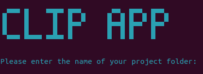

# CLIP application

Refonte de l'application développée par [ThorkildFregi](https://github.com/ThorkildFregi) et [Altomator](https://github.com/altomator).

**NOTA BENE**: l'intégration d'une étape de _fine-tuning_ est en développement.

**ATTENTION** : l'application ne peut plus être installée sur les dernières versions de Mac en raison de conflits de paquets.

L'application utilise le modèle CLIP (_Contrastive Language-Image Pre-training_) pour traiter un fonds d'images et l'interroger avec des requêtes textuelles, le tout depuis une interface web.

- [Cloner l'application](https://github.com/NatachaGrim/Application-CLIP/blob/main/README_FR.md#cloner-lapplication)
- [Structure](https://github.com/NatachaGrim/Application-CLIP/blob/main/README_FR.md#structure)
  - [Dossiers et fichiers à créer](https://github.com/NatachaGrim/Application-CLIP/blob/main/README_FR.md#dossiers-et-fichiers-%C3%A0-cr%C3%A9er)
  - [Données requises](https://github.com/NatachaGrim/Application-CLIP/blob/main/README_FR.md#donn%C3%A9es-requises)
  - [Fichiers générés](https://github.com/NatachaGrim/Application-CLIP/blob/main/README_FR.md#fichiers-g%C3%A9n%C3%A9r%C3%A9s)
- [Installer l'environnement virtuel](https://github.com/NatachaGrim/Application-CLIP/blob/main/README_FR.md#installer-lenvironnement-virtuel)
  - [Installer Python](https://github.com/NatachaGrim/Application-CLIP/blob/main/README_FR.md#%C3%A9tape-1--installer-python)
  - [Créer l'environnement virtuel](https://github.com/NatachaGrim/Application-CLIP/blob/main/README_FR.md#%C3%A9tape-2--cr%C3%A9er-lenvironnement-virtuel)
  - [Installer les dépendances](https://github.com/NatachaGrim/Application-CLIP/blob/main/README_FR.md#%C3%A9tape-3--installer-les-d%C3%A9pendances)
- [Lancement](https://github.com/NatachaGrim/Application-CLIP/blob/main/README_FR.md#lancement)
  - [Se positionner au bon endroit](https://github.com/NatachaGrim/Application-CLIP/blob/main/README_FR.md#%C3%A9tape-1--se-positionner-au-bon-endroit)
  - [Activer l'environnement virtuel](https://github.com/NatachaGrim/Application-CLIP/blob/main/README_FR.md#%C3%A9tape-2--activer-lenvironnement-virtuel)
  - [Lancer le _launcher_](https://github.com/NatachaGrim/Application-CLIP/blob/main/README_FR.md#%C3%A9tape-3--lancer-le-launcher)
  - [Quitter l'application](https://github.com/NatachaGrim/Application-CLIP/blob/main/README_FR.md#%C3%A9tape-4--quitter-lapplication)

- [Gestion des mises à jour](https://github.com/NatachaGrim/Application-CLIP/blob/main/README_FR.md#lancement)
  - [Mettre à jour l'application](https://github.com/NatachaGrim/Application-CLIP/blob/main/README_FR.md#%C3%A9tape-1--se-positionner-au-bon-endroit)
  - [Mettre à jour l'ontologie](https://github.com/NatachaGrim/Application-CLIP/blob/main/README_FR.md#%C3%A9tape-2--activer-lenvironnement-virtuel)
__________

## Cloner l'application

En haut de la page GitHub se trouve un bouton vert ```<> Code```. Cliquez dessus et copiez l'URL affiché dans la section ```HTTPS```. Saisissez la commande suivante à l'emplacement de votre choix :

```
git clone <collezl'URL>
```

## Structure

Pour utiliser l'application, il faut intégrer un fonds d'images et une ontologie dans sa structure. Ci-dessous, son architecture de base :

```
📁 CLIP-app
 ├─── 📁 app
 │     ├─── app.py
 │     ├─── config.py
 │     ├─── 📁 models
 │     ├─── 📁 routes
 │     ├─── 📁 scripts
 │     ├─── 📁 static
 │     ├─── 📁 templates
 │     └─── 📁 utils
 ├─── 📁 clip_env
 ├─── launch_PowerShell
 ├─── launch_Bash
 ├─── run.py
 └─── requirements.txt
```

### Dossiers et fichiers à créer

C'est dans le dossier ```📁 static``` que vous chargez vos données. Vous devez créer les dossiers suivants en son sein :

```
📁 static
 └─── 📁 project_name
       ├─── 📁 images
       │     ├─── 📁 subfoler_01
       │     ├─── 📁 subfolder_02
       │     └─── 📁 subfolder_...
       └─── 📁 ontology
             └─── project_name_ontology.txt
```

Vous pouvez librement nommer le dossier ```📁 project_name``` ainsi que chaque ```📁 subfolder``` (les espaces, accents et caractères spéciaux sont proscrits). En conséquence, le fichier ```project_name_ontology.txt``` doit être nommé d'après le nom du dossier ```📁 project_name```. Le nom des dossiers ```📁 images``` et ```📁 ontology``` doit rester inchangé :

```
📁 static
 └─── 📁 Royere
       ├─── 📁 images
       │     ├─── 📁 petites_gouaches
       │     ├─── 📁 grandes_gouaches
       │     ├─── 📁 calques_vue_ensemble
       │     └─── 📁 calques_execution
       └─── 📁 ontology
             └─── Royere_ontology.txt
```

### Données requises

L'application a besoin de deux types de données pour fonctionner : des données visuelles (images) et des données textuelles (ontologie).
- Les images se trouvent dans le dossier ```📁 images``` ;
- L'ontologie se trouve dans le fichier ```project_name_ontology.txt```.

Le fichier d'ontologie ```.txt``` contient les mots-clés et leur description. La structure ci-dessous doit être respectée :

```
"Chaise": "siège à dossier et généralement sans bras"
"Tapis": "panneau d'étoffe, ouvrage que l'on pose sur un meuble, un mur ou un sol"
"Luminaire": "tout objet constituant l'éclairage et la décoration lumineuse"
```

### Fichiers générés

Les scripts exécutés lors du lancement vont générer trois fichiers dans le dossier ```📁 project_name``` :

- ```project_name_ontology.csv``` ;
- ```project_name_list.txt``` ;
- ```project_name_directory.txt```.

Le fichier ```project_name_ontology.csv``` résulte de la conversion du fichier ```project_name_ontology.txt``` au format ```.csv```. Il sera utilisé par le modèle pour traiter les requêtes.

Le fichier ```project_name_list.txt``` liste les images du fonds et indique leur chemin relatif.

Le fichier ```project_name_directory.txt``` synthétise des informations sur le dossier ```📁 project_name``` : son chemin relatif, son chemin absolu, le nombre de sous-dossiers et le nombre total d'images. Sur un pas de 10, le chemin d'une image est listé.

Une fois les scripts exécutés, la structure du dossier ```📁 project_name``` est donc la suivante :

```
📁 static
 └─── 📁 project_name
       ├─── 📁 images
       ├─── 📁 ontology
       │     ├─── project_name_ontology.txt
       │     └─── project_name_ontology.csv
       ├─── project_name_list.txt
       └─── project_name_directory.txt
```

Le dernier fichier à être généré en amont du lancement de l'application se trouve dans le dossier ```📁 models```. Il s'agit d'un fichier contenant les représentations vectorielles des images (_embeddings_). Le temps nécessaire à la création de ce fichier dépend du nombre d'images chargées ainsi que de votre puissance de calcul.

Il est fondamental de ne pas interrompre l'exécution des scripts. Cela ne prendra du temps que pour le premier lancement car il ces fichiers n'ont besoin d'être générés qu'une seule fois.

__________

## Installer l'environnement virtuel

À la racine de l'application se trouve le dossier ```📁 clip_env```. Il s'agit de l'environnement virtuel qu'il faut créer pour faire fonctionner le code de l'application.

### Étape 1 : installer Python

[Python pour Windows](https://www.python.org/downloads/)

[Python pour Mac](https://www.python.org/downloads/macos/)

Python pour Linux :
```
sudo apt install python3
```

### Étape 2 : créer l'environnement virtuel

Ouvrez votre terminal et utilisez la commande ```cd nom_de_dossier``` pour vous déplacer dans l'ordinateur. Tapez la commande ```cd ..``` pour revenir un cran en arrière. Positionnez-vous dans le dossier ```📁 CLIP-app``` puis exécutez la commande suivante :

Windows :
```
python -m venv clip_env
```

Mac :
```
python3 -m venv clip_env
```

Linux : 
```
virtualenv clip_env -p python3
```

### Étape 3 : installer les dépendances

Activez l'environnement virtuel :

Windows :
```
.\clip_env\Scripts\activate
```

Mac et Linux :
```
source clip_env/bin/activate
```

Installez les dépendances contenues dans le fichier ```requirements.txt``` :
```
pip install -r requirements.txt
```

Désactivez l'environnement virtuel :
```
deactivate
```

Vous disposez maintenant d'un environnement virtuel. Vous devrez l'activer à chaque lancement de l'application et le désactiver après chaque session d'utilisation.

__________

## Lancement

Vous devez suivre les étapes suivantes à chaque lancement de l'application.

### Étape 1 : se positionner au bon endroit

Positionnez-vous dans le dossier ```📁 CLIP-app```.

### Étape 2 : activer l'environnement virtuel

Windows : 
```
.\clip_env\Scripts\activate
```

Mac et Linux :
```
source clip_env/bin/activate
```

### Étape 3 : lancer le _launcher_

Windows :

```
.\launch_PowerShell.ps1
```

Mac et Linux :
```
bash launch_Bash.sh
```

L'une de ces deux interfaces devrait s'afficher :




Saisissez le nom de votre ```📁 project_name```. L'application s'ouvrira dans le navigateur par défaut. Si l'erreur "La connexion a échoué" s'affiche, rafraîchissez la page. L'application prendra plus ou moins de temps à se lancer en fonction de la qualité de votre connexion.

### Étape 4 : quitter l'application

Depuis le terminal, pressez simplement la touche ```ctrl``` enfoncée et appuyez sur la touche ```c```. N'oubliez pas de désactiver l'environnement virtuel.

## Gestion des mises à jour

### Mettre à jour l'application

Avant chaque lancement, déplacez-vous dans le dossier racine de l'application et saisissez les commandes suivantes :

```
git fetch
```
```
git pull
```

Cela permet de mettre à jour votre clone par rapport à la version du code source hébergé sur ce dépôt.

### Mettre à jour l'ontologie

Si votre ontologie vient à évoluer, mettez simplement à jour le fichier ```.txt```. Au prochain lancement de l'application, le fichier ```.csv``` se mettra à jour.
